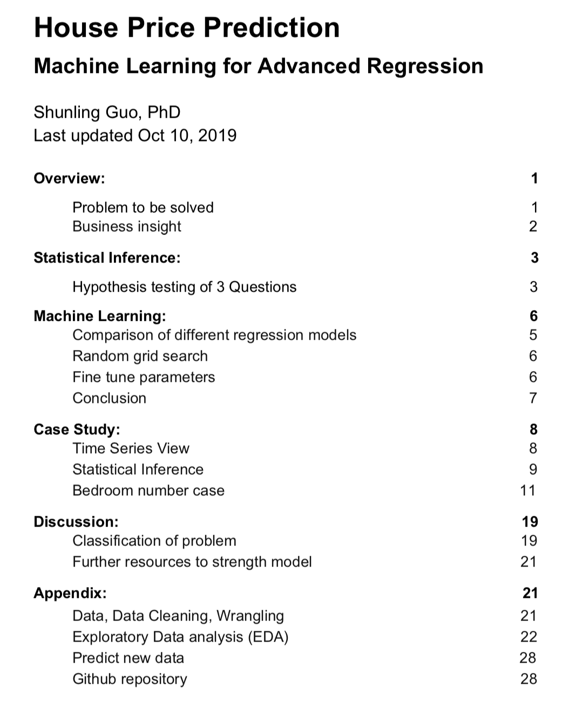
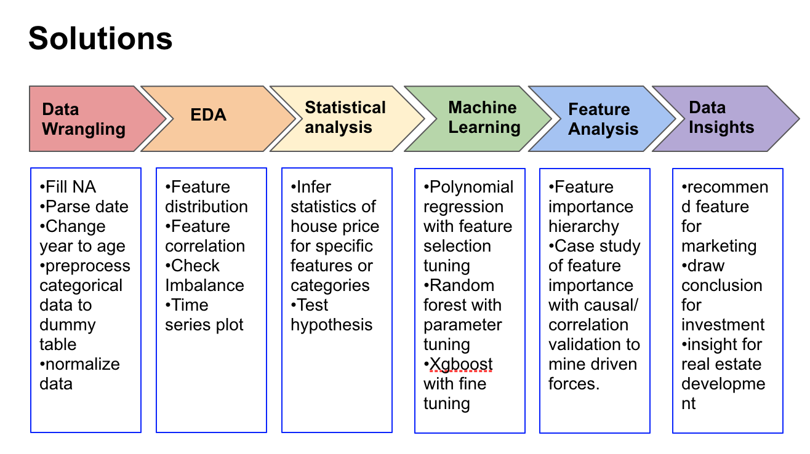
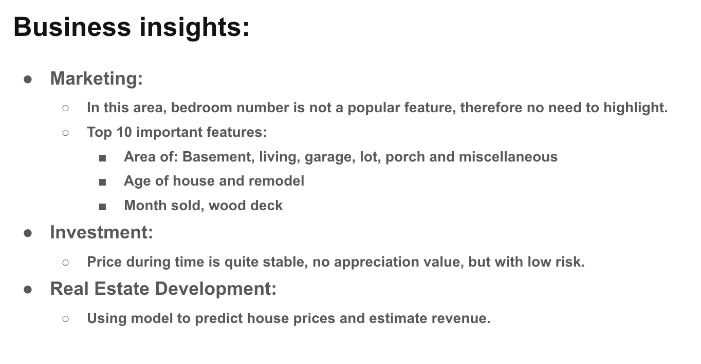

# CapstoneProject1
***

<h3>Capstone Project 1</h3>
 
<b>House Price prediction:</b> <ol>
•Full stack Data Science project including data cleaning, wrangling, EDA, statistical analysis, polynomial/random_forest/Xgboost modeling for machine learning and storytelling.
 
•Detail analysis of feature distribution, correlation and causation with house price, mined important features for marketing, prediction precision within an average $10k for each house buyer and $20k for each seller.
 
•Tools used: pandas, numpy, json, matplotlib, seaborns, ipython, ipywidgets, sklearn, pickle, statsmodel, scipy, xgboost.

<ol>

### Final report

    
• [Final report: check_link_here](https://github.com/Shunling/CapstoneProjects/blob/master/HousePriceRegression/HousePriceAdvancedRegression-Report.pdf)

snapshot of report:

• [Presentation: check_link_here](https://github.com/Shunling/CapstoneProjects/blob/master/HousePriceRegression/HousePricePrediction.pdf)

snapshots of presentation:

  
### Jupyter Notebooks:
<ol>

<li> Data cleaning, wrangling, processing protocol 

[DataCleaning_Wrangling](https://github.com/Shunling/CapstoneProjects/blob/master/HousePriceRegression/Shirley_HousePriceRegression_DataCleaning_Wrangling.ipynb)

[DataPreprocessing](https://github.com/Shunling/CapstoneProjects/blob/master/HousePriceRegression/Shirley_HousePriceRegression_DataPreprocessing.ipynb)

<li> Machine learning with fine tuning 

[ML_Polynomial](https://github.com/Shunling/CapstoneProjects/blob/master/HousePriceRegression/Shirley_HousePriceRegression_ML_Polynomial.ipynb)

[ML_RandomForest](https://github.com/Shunling/CapstoneProjects/blob/master/HousePriceRegression/Shirley_HousePriceRegression_ML_RandomForest.ipynb)

[ML_Xgboost](https://github.com/Shunling/CapstoneProjects/blob/master/HousePriceRegression/Shirley_HousePriceRegression_ML_Xgboost.ipynb)

[ML_Xgboost_2](https://github.com/Shunling/CapstoneProjects/blob/master/HousePriceRegression/Shirley_HousePriceRegression_ML_Xgboost_2.ipynb)

[ML_Xgboost_Fine_tuning](https://github.com/Shunling/CapstoneProjects/blob/master/HousePriceRegression/Shirley_HousePriceRegression_ML_Xgboost_Fine_tuning.ipynb)

<li> Statistical analysis and storytelling 

[Statistical_Analysis](https://github.com/Shunling/CapstoneProjects/blob/master/HousePriceRegression/Shirley_HousePriceRegression_Statistical_Analysis.ipynb)

[EDA_StoryTelling](https://github.com/Shunling/CapstoneProjects/blob/master/HousePriceRegression/Shirley_HousePriceRegression_EDA_StoryTelling.ipynb)

[more_EDA](https://github.com/Shunling/CapstoneProjects/blob/master/HousePriceRegression/Shirley_HousePriceRegression_more_EDA.ipynb)

[Model Validation](https://github.com/Shunling/CapstoneProjects/blob/master/HousePriceRegression/Shirley_HousePriceRegression_Data_insight_price_dif.ipynb)

<li> Prediction of new data 

[Xgboost_Predict_Preprocess_Test_Data](https://github.com/Shunling/CapstoneProjects/blob/master/HousePriceRegression/Shirley_HousePriceRegression_Xgboost_Predict_Preprocess_Test_Data.ipynb)

[Xgboost_Prediction](https://github.com/Shunling/CapstoneProjects/blob/master/HousePriceRegression/Shirley_HousePriceRegression_Xgboost_Prediction.ipynb)