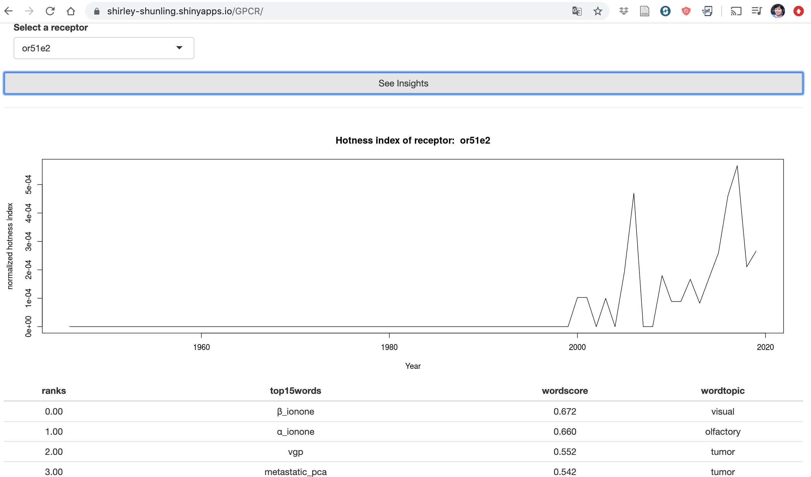

# CapstoneProject2

G protein coupled receptor (GPCR) family is the biggest protein family for drug targets. This project would help laymen quickly glance insights for GPCR related research and products (e.g. drugs), and also would provide rich resource for research scientists to dig valuable information to help them make decisions for future research directions, and to build a more comprehensive understanding of the research trends and topics in GPCR field.

This project scrapped 300K+ papers published during 1948 - 2019, which containing ‘G protein coupled receptor’ in abstract and/or title. The following columns for each paper were formatted: 
Pubmed_ID, Title, Abstract, Affiliation, Publication Date, Keywords.

300+ receptors out of all 790 GPCRs were found with 10+ publications, and their research trends were plotted. 

Python word2vec (neural network), space and nltk packages were used to vectorize literature corpus.

35 topics were predicted via unsupervised clustering, and the top8 topics (or less) were extracted for each paper.

Topics were also extracted based on keywords(~10% of total papers have keywords), which could be considered as mannually draw topics, and accuracy was calculated by how much percentage of topics from keywords were correctly predicted by title and abstract. 

Findings were deployed by R-shiny website. See Final report.

***

<h3>Capstone Project 2</h3>
 
<b>Natural Language Processing of GPCR publications to extract research insight for drug discovery:</b> <ol>
•Full stack Data Science project including data curation, data cleaning, wrangling, EDA, statistical analysis, neural network modeling topic and classification.
 
•Predict topics using neural network and KMeans clustering to reveal research trends, accuracy > 92%. Build dashboard to visualize research trend in topics, genes/drug-targets and drug development.
 
•Tools used: pandas, numpy, json, matplotlib, seaborns, Entrez, requests, bs4, re, spacy, nltk, gensim,  pickle, pyLDAvis.

### Final report and deploy
[Medium Post](https://medium.com/@shunling.guo/gpcr-research-trends-fb827144da02)

This Medium post describes the process of the project and explanation/rational for each step.

[R-Shiny websites](https://shirley-shunling.shinyapps.io/GPCR/)

This website deployed part of the application of this project, including: the research hotness index chart(paper published regarding this receptor/total paper published that year) for 300+ receptors (100+ are drug targets), and top15 closest research topics table, and the connectome graph of the 300+ G protein coupled receptors.

### Jupyter Notebooks:
<ol>

<li> Data collection, cleaning, wrangling 

Data scrapping from NCBI:

[DataCuration](https://github.com/Shunling/CapstoneProjects/blob/master/NaturalLanguageProcessingGPCR/DataCollection.ipynb)

Process language by space and nltk packages including: Strip_html, extract year, extract affiliation, normalize and lemmatize text and keywords.

[DataCleaning](https://github.com/Shunling/CapstoneProjects/blob/master/NaturalLanguageProcessingGPCR/DataCleaning.ipynb)

[DataWrangling and Preprocessing](https://github.com/Shunling/CapstoneProjects/blob/master/NaturalLanguageProcessingGPCR/DataPreprocessing.ipynb)

<li> Modeling </li>
Reformat information by extract affiliation, Preprocess data to fourgram phrases:

[Phrase modeling](https://github.com/Shunling/CapstoneProjects/blob/master/NaturalLanguageProcessingGPCR/FourgramPhrases_Text.ipynb)

Use Word2Vec to vectorize corpus:

[Vectorization by Neural Network](https://github.com/Shunling/CapstoneProjects/blob/master/NaturalLanguageProcessingGPCR/WordVecterization_Word2Vec.ipynb)

Unsupervised Clustering to optimized number of topics:

[Topic modeling by Clustering](https://github.com/Shunling/CapstoneProjects/blob/master/NaturalLanguageProcessingGPCR/Clustering.ipynb)

<li> Data Insights </li>

Predict topic and calculate accuracy:

[Topic analysis](https://github.com/Shunling/CapstoneProjects/blob/master/NaturalLanguageProcessingGPCR/TopicPrediction.ipynb)

Plot research trend:

[Reseach Trend](https://github.com/Shunling/CapstoneProjects/blob/master/NaturalLanguageProcessingGPCR/ResearchTrend.ipynb)